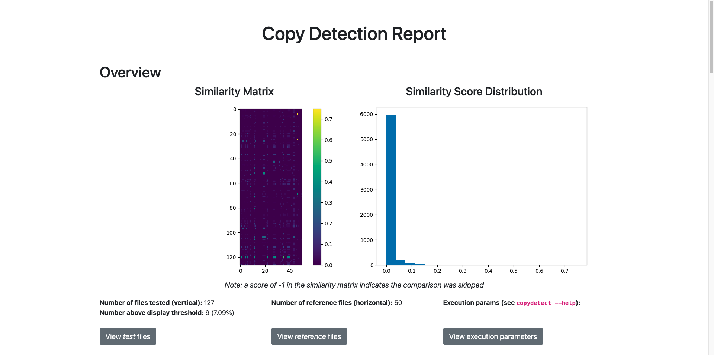

Thank you very much for bringing the license issue to our attention. First and foremost, I sincerely apologize for my mistake. RAGLAB is the first repository I have developed and maintained. As a beginner, I lack experience in managing large projects, particularly in areas such as creating well-crafted README files, icons, and licenses.

FlashRAG is an outstanding open-source project that has made significant contributions to the RAG community. I acknowledge my mistake in copying FlashRAG's LICENSE file and referencing the style of their readme document. Our error is limited to the readme file only. However, we absolutely did not plagiarize FlashRAG's code. I deeply regret this error and once again apologize to everyone for my mistake.

Furthermore, **we must clarify that all code in RAGLAB was developed independently by our team.** We have open-sourced the [raglab-exp](https://github.com/fate-ubw/raglab-exp) repository to provide evidence that the RAGLAB repository was independently developed. The raglab-exp repository contains over 400 commit records, which serve as strong evidence supporting our claim. The reason we had not previously open-sourced the raglab-exp repository is that we were in the process of developing new algorithms. Additionally, we have used [copydetect](https://github.com/blingenf/copydetect) to analyze the code similarity between RAGLAB and FlashRAG. The experimental results can be found in the [code copydetect result](./reply_for_issue1/report.html).

**Reply for [issues#1](https://github.com/fate-ubw/RAGLAB/issues/1)**

Q1: In paper Table 1, you claim that FlashRAG lacks fair comparison，but it seems to support fair comparisons of different methods?
- The initial motivation for designing RAGLAB was our discovery during literature review that published algorithms do not provide a fair comparison. The key components used in different papers, such as the knowledge database, retriever model, generation model, and instructions, vary significantly. We pointed out that FlashRAG lacks a fair comparison because it does not provide a unified generation model.

    In FlashRAG:

    - The SelfRAG algorithm uses SelfRAG-LLama2-7B, which, compared to LLama2-7B, was trained on an additional 140,000 data points during fine-tuning. This creates an unfair advantage over other generation models.
    - The Spring algorithm uses LLama2-7B-chat with a trained embedding table.
    - The Ret-Robust algorithm uses LLama2-13B with a trained LoRA.
    - The remaining algorithms use LLama3-8B-instruct.
  
    Thus, the different algorithms in FlashRAG do not utilize the same base model as the generator, which is why we believe FlashRAG lacks fair comparisons. We have already highlighted this point in our paper.

- During the evaluation of RAGLAB, we used Llama3-8B as the base model and trained four models based on it: [llama3-8B-baseline](https://huggingface.co/RAGLAB/Llama3-8B-baseline), [selfrag-llama3-8b](https://huggingface.co/RAGLAB/selfrag_llama3-8B), [llama3-70B-adaptor](https://huggingface.co/RAGLAB/Llama3-70B-baseline-adapter), and [selfrag-llama3-70B-adaptor](https://huggingface.co/RAGLAB/selfrag_llama3_70B-adapter).
**RAGLAB is the first project to train the selfrag-llama3-70B-adaptor model, and has open-sourced it on the Hugging Face website**
 During the training process, we used the same training parameters, the same training scripts, and the same training data (utilizing SelfRAG's open-source training data [url](https://huggingface.co/datasets/selfrag/selfrag_train_data); all special tokens were removed when training the llama3-8B-baseline and llama3-70B-adaptor models). After training on the same data, we believe that **llama3-8B-baseline** and **selfrag-llama3-8B** are fairly comparable, as are **llama3-70B-adaptor** and **selfrag-70B-adaptor**. This is an aspect that FlashRAG has not addressed. Additionally, we have open-sourced the entire process, including the training dataset [url](https://huggingface.co/datasets/RAGLAB/data/tree/main/train_data), training script parameters [url](https://github.com/fate-ubw/RAGLAB/tree/main/run/rag_train), and all four models.

Q2. To my knowledge, FlashRAG does not have a trainer and does not match the claim in the paper.
- Thank you very much for pointing out the error in our paper. In Table 1, under the `Trainer` column, we mistakenly indicated that FlashRAG includes a trainer function. This was a writing error on my part. You are correct FlashRAG does not provide any trainer-related functionality. We have corrected this mistake in our paper on arXiv and have uploaded a revised version. Once again, thank you for bringing this issue to our attention.

Q3. The license for the warehouse is from FlashRAG, and even the name is the same as its author.
- I would like to sincerely apologize for copying the FlashRAG license. Due to my lack of experience in maintaining open-source projects, I was unaware of how to properly draft a standard license file, which led to my copying the FlashRAG license. I apologize to the authors of FlashRAG for this mistake. We have already uploaded a new license file to correct this error. Additionally, we have sent an email to the authors of FlashRAG to inform them of the situation and to apologize. We are actively communicating with the FlashRAG authors, and we will provide updates on the outcome as soon as possible.

Q4. The overall design structure and diagram are very similar
- I would like to make a brief statement regarding RAGLAB. **First, the framework design of RAGLAB is different from that of FlashRAG.** RAGLAB does not categorize different advanced RAG algorithms nor does it abstract a pipeline class; instead, each algorithm is abstracted into a separate class corresponding to an individual Python file. In contrast, FlashRAG categorizes different algorithms and designs distinct pipelines for each category, with algorithms using the same pipeline being grouped into a single Python file. RAGLAB considers all advanced algorithms as improvements upon NaiveRAG, so all algorithms in RAGLAB inherit from NaiveRAG, and all utils are defined within NaiveRAG. This is fundamentally different from FlashRAG, where different advanced RAG algorithms inherit from different pipelines.

    Secondly, I would like to address the issue regarding the similarity between RAGLAB and FlashRAG diagrams. In RAGLAB, all advanced RAG algorithms inherit from the NaiveRAG algorithm, with NaiveRAG providing a wide range of utilities. On the other hand, in FlashRAG, there is no inheritance relationship between different pipelines, which is a fundamental difference between RAGLAB and FlashRAG. For more detailed differences, please refer to the [raglab-vs-flashrag](#differences-in-system-design-between-raglab-and-flashrag) section.

- To demonstrate that RAGLAB was developed independently, we have compared the creation timesline of RAGLAB and FlashRAG, as well as the progress of algorithm development. For specific details, please refer to the table in the next section [Table](#comparison-of-the-creation-times-and-algorithm-development-progress-between-the-raglab-and-flashrag-repositories).

**Comparison of the Creation Times and Algorithm Development Progress between the RAGLAB and FlashRAG Repositories**

| Time Nodes | RAGLAB | evidence | FlashRAG | evidence | Whether RAGLAB is earlier than FlashRAG |
|:------:|:--------:|:------:|:----------:|:------:|:----:|
| GitHub Repository Creation Time  | 2024-02-07 | [url](https://api.github.com/repos/fate-ubw/raglab-exp)  [init-time](./reply_for_issue1/raglab_init_time.jpg) | 2024-03-14 | [url](https://api.github.com/repos/RUC-NLPIR/FlashRAG)  [init-time](./reply_for_issue1/flashrag_init_time.jpg) | ✅ |
| NaiveRAG's Development Time | 2024-02-12 | [url](https://github.com/fate-ubw/raglab-exp/commit/8430af3d624606f4ad276f6876054009829ca163) | 2024-04-04 (Deleted) | [url](https://github.com/RUC-NLPIR/FlashRAG/commit/da6c214a9091b87a0b43f6c6b980633137f9ce60) | ✅ |
|BasicPipeline's Development Time| Not Developed| | 2024-03-19 |[url](https://github.com/RUC-NLPIR/FlashRAG/commit/80d54d0028b4f80ece5a9bea90aaab757ea251fe) | - |
|SequentialPipeline's Development Time| Not Developed| | 2024-03-19 |[url](https://github.com/RUC-NLPIR/FlashRAG/commit/80d54d0028b4f80ece5a9bea90aaab757ea251fe) | - |
| selfrag's Development Time | 2024-02-26 | [url](https://github.com/fate-ubw/raglab-exp/commit/038cef15baa84f7b548d10aab3192f591cf3be45) | 2024-04-09 | [url](https://github.com/RUC-NLPIR/FlashRAG/commit/af18ba5bb339f38e4396b2039cbd98168416b9c5) | ✅ |
| RRR's Development Time | 2024-03-04 | [url](https://github.com/fate-ubw/raglab-exp/commit/9897c7a33ccbf7c548ce19e9f411915f5997ebf4) | Not Developed |  | - |
| iter-gen's Development Time | 2024-03-09 | [url](https://github.com/fate-ubw/raglab-exp/commit/acd5a652f9a41bd5ff332a79a14a43b9d7b6c974) | 2024-04-08 | [url](https://github.com/RUC-NLPIR/FlashRAG/commit/0472c8956e5c8c5467384ba208cde96e85aa71ac) | ✅ |
| active rag's Development Time | 2024-03-09 | [url](https://github.com/fate-ubw/raglab-exp/commit/acd5a652f9a41bd5ff332a79a14a43b9d7b6c974) | 2024-04-11 | [url](https://github.com/RUC-NLPIR/FlashRAG/commit/e3c3d577fbf51461eb69dd9b4a545c9650dcba2a) |✅ |
| DSP's Development Time | 2024-03-29(Developed) 2024-04-22(Deleted) | [url-dev](https://github.com/fate-ubw/raglab-exp/commit/93fb3e2783f54110b82e62afb243e85031eff227)   [url-remove](https://github.com/fate-ubw/raglab-exp/commit/df39bd162cd95ef54eb2a3cb6ea980968380e5db)| Not Developed |  | - |
| selfask's Development Time | 2024-04-08 | [url](https://github.com/fate-ubw/raglab-exp/commit/a0535c3de2c997d93114746f79eace5a2faecc31) | 2024-04-13 | [url](https://github.com/RUC-NLPIR/FlashRAG/commit/8a85dc2204d591ac4014e0963751f4011d5e4962) | ✅ |
| GitHub Repository Open Source Time | 2024-08-05 | [url](https://github.com/fate-ubw/RAGLAB/commit/759ee8e52d065b2c5c39dc7c5f2913c9fe098f9b)  | 2024-05-24 | [public-1](./reply_for_issue1/flashrag_public_time-1.jpg) [public-2](./reply_for_issue1/flashrag_public_time-2.jpg)  [public-3](./reply_for_issue1/flashrag_public_time-3.jpg) [public-4](./reply_for_issue1/flashrag_public_time-4.jpg) |❌ |
| Arxiv Paper Publication Date | 2024-08-21 | [url](https://arxiv.org/abs/2408.11381) | 2024-05-22 | [url](https://arxiv.org/abs/2405.13576) | ❌ |

> [!Note]   
> 1. The open-source date of the FlashRAG repository cannot be determined from the commit files, so we used Google search with a time filter to find the date when the FlashRAG repository was made public.
> 2. The NaiveRAG's Develop Time in FlashRAG is the date of record deletion, not the development date.
> 3. For algorithms that have not been developed, we filled in 'Not Developed' in the table.
> 4. RAGLAB initially attempted to develop the DSP algorithm, but after multiple discussions, we concluded that DSP is not suitable for comparison with advanced RAG algorithms. As a result, we deleted the DSP algorithm on 2024-04-22. The commit record of the deletion can be found here: [url](https://github.com/fate-ubw/raglab-exp/commit/df39bd162cd95ef54eb2a3cb6ea980968380e5db).

**Summary:**
1. The RAGLAB repository was created earlier than FlashRAG.
2. The development of all six RAGLAB algorithms is earlier than those of FlashRAG.
3. Additionally, RAGLAB developed the RRR and DSP algorithms, which were not developed by FlashRAG, while FlashRAG developed the BasicPipeline and SequentialPipeline through its pipeline, which were not developed by RAGLAB.
4. Furthermore, it is important to note that FlashRAG published its paper on 2024-05-22, with the repository going public on 2024-05-24. This suggests that we could not have known about the existence of the FlashRAG project before 2024-05-22, nor could we have accessed the FlashRAG source code before it was published on 2024-05-24. **Based on this information, we can confirm that RAGLAB could not have copied the FlashRAG repository.**
5. FlashRAG integrated more algorithms and made its repository public earlier, while RAGLAB made its repository public later. This information demonstrates that RAGLAB and FlashRAG are two independent works developed during the same period, and there is no possibility that RAGLAB copied the FlashRAG repository. The only mistake made by RAGLAB was that, due to a lack of experience with open-source projects, we did not draft our own license file and instead directly copied the FlashRAG license file, for which we apologize once again.

**Code Similarity Test between RAGLAB and FlashRAG**
- We conducted a similarity analysis of the RAGLAB and FlashRAG code using [copydetect](https://github.com/blingenf/copydetect)
- Experimental process:
    ~~~bash
    pip install copydetect
    git clone https://github.com/RUC-NLPIR/FlashRAG.git
    git clone https://github.com/fate-ubw/RAGLAB.git
    copydetect -t RAGLAB -r FlashRAG -e py
    ~~~
- Experimental results:

- For a detailed experimental report, please refer to [copydetect result](./reply_for_issue1/report.html). Please download and open it in your browser.

**Differences in System Design between RAGLAB and FlashRAG**
 

1. **Different Framework Design Concepts**: RAGLAB does not categorize different advanced RAG algorithms, nor does it abstract a pipeline class. Instead, each algorithm is abstracted into a separate class corresponding to an individual Python file. In contrast, FlashRAG categorizes different algorithms and designs distinct pipelines for each category, with algorithms using the same pipeline grouped into a single Python file. RAGLAB considers all advanced algorithms as improvements upon NaiveRAG, so all algorithms in RAGLAB inherit from NaiveRAG, and all utils are defined within NaiveRAG. This is a fundamental difference from FlashRAG, where different advanced RAG algorithms inherit from different pipelines. RAGLAB currently integrates six advanced algorithms, while FlashRAG integrates 14 algorithms.
   
2. **Generator Alignment Differences**: During the evaluation of RAGLAB, we used Llama3-8B as the base model and trained four models based on it: [llama3-8B-baseline](https://huggingface.co/RAGLAB/Llama3-8B-baseline), [selfrag-llama3-8b](https://huggingface.co/RAGLAB/selfrag_llama3-8B), [llama3-70B-adaptor](https://huggingface.co/RAGLAB/Llama3-70B-baseline-adapter), and [selfrag-llama3-70B-adaptor](https://huggingface.co/RAGLAB/selfrag_llama3_70B-adapter). During the training process, we used the same training parameters, the same training scripts, and the same training data (using SelfRAG's open-source training data [url](https://huggingface.co/datasets/selfrag/selfrag_train_data); all special tokens were removed when training the llama3-8B-baseline and llama3-70B-adaptor models). After training on the same data, we believe that **llama3-8B-baseline** and **selfrag-llama3-8b** are fairly comparable, as are **llama3-70B-adaptor** and **selfrag-70B-adaptor**. FlashRAG, however, did not use a unified base model for training; instead, different algorithms used different models.

    In our paper, we argued that FlashRAG lacks fair comparisons because it did not use a unified base model for training, but rather different algorithms used different models:
    1) In FlashRAG, the SelfRAG algorithm uses selfrag-llama2-7B, which, compared to llama2-7B, was trained on an additional 140,000 data points during fine-tuning, creating an unfair advantage over other generation models.
    2) The Spring algorithm in FlashRAG uses Llama2-7B-chat with a trained embedding table.
    3) The Ret-Robust algorithm in FlashRAG uses LLAMA2-13B with a trained LoRA.
    4) The remaining algorithms in FlashRAG use LLAMA3-8B-instruct.

    Thus, the different algorithms in FlashRAG do not utilize the same base model as the generator, which is why we believe FlashRAG lacks fair comparisons. We have already highlighted this point in our paper.

3. **Different Retrievers**: RAGLAB integrates two retrieval models, **[ColBERT](https://github.com/fate-ubw/RAGLAB/blob/main/raglab/retrieval/colbert/colbert_retrieve.py) and [Contriever](https://github.com/fate-ubw/RAGLAB/blob/main/raglab/retrieval/contriever/contriever_retrieve.py)**, whereas FlashRAG does not integrate ColBERT or handle ColBERT embeddings. RAGLAB designed a **[ColBERT Server & API](https://github.com/fate-ubw/RAGLAB/tree/main/raglab/retrieval/colbert_api)** functionality that allows over 10 scripts to concurrently access the ColBERT server. ColBERT Server & API feature significantly conserves resources and addresses our limited resource issues, but FlashRAG does not provide this functionality. On the other hand, FlashRAG integrates BM25, embedding models, and T5-based models, which RAGLAB does not.

4. **Interact Mode & Evaluation Mode**: We developed both an [Interact Mode](https://github.com/fate-ubw/RAGLAB/blob/main/raglab/rag/infer_alg/self_rag_reproduction/selfrag_reproduction.py#L42) and an [Eval Mode](https://github.com/fate-ubw/RAGLAB/blob/main/raglab/rag/infer_alg/self_rag_reproduction/selfrag_reproduction.py#L60) for each algorithm. The goal of Interact Mode is to allow non-research users to quickly understand the essence of the algorithms without needing to download datasets. Evaluation Mode is designed to replicate the results presented in the paper. FlashRAG did not design an Interact Mode for each algorithm; instead, it created a UI interface specifically for Simple RAG.

5. **Evaluation Section**: In addition to accuracy, F1 score, and exact match (EM), we also integrated [FactScore](https://github.com/fate-ubw/RAGLAB/tree/main/FActScore) and [ALCE](https://github.com/fate-ubw/RAGLAB/tree/main/ALCE), two advanced metrics. However, FlashRAG did not integrate or evaluate FactScore and ALCE.
   
6. **Completely Different Dataset Loader Design**: RAGLAB does not process raw datasets; instead, it designs a separate class for each dataset to directly load the raw dataset. Please refer to the [dataset class](https://github.com/fate-ubw/RAGLAB/tree/main/raglab/dataset)
FlashRAG, on the other hand, processed 32 datasets from scratch and unified the format of all datasets. Therefore, FlashRAG does not need to create a new class for each dataset. The 32 datasets open-sourced by FlashRAG provide significant convenience for researchers and make a substantial contribution to the RAG open-source community.

7. **Instruction Lab**: To align each component, especially the impact of instructions on results, RAGLAB adopted a design approach that separates algorithm logic from data. We built [instruction_lab.py](https://github.com/fate-ubw/RAGLAB/blob/main/raglab/instruction_lab/instruction_lab.py), where all algorithms load their instructions and prompts from the Instruction Lab to ensure alignment across different algorithms. FlashRAG, on the other hand, constructs instructions by defining `PromptTemplate` within the algorithm itself, as can be seen in [pipeline.py](https://github.com/RUC-NLPIR/FlashRAG/blob/main/flashrag/pipeline/pipeline.py#L157). FlashRAG does not separate algorithm logic from specific instruction, while RAGLAB separates all instructions from algorithm logic, achieving centralized management of instructions. There is a fundamental difference between RAGLAB and FlashRAG in the implementation of instructions.

   
8.  **Logger**: To facilitate the management of experimental results, we designed a logger that can save all log information generated during the evaluation process and store it separately as a `.log` file. However, FlashRAG does not provide this functionality.
   
9.  **Different Experimental Conclusions**: RAGLAB evaluated the performance of six algorithms on the **ARC, MMLU, PubHealth, StrategyQA, and Multiple-choice tasks, as well as on the FactScore and ALCE datasets**. However, FlashRAG did not evaluate the aforementioned tasks; instead, FlashRAG evaluated the **NQ and WebQA** datasets, which RAGLAB did not assess.

Finally, we once again apologize for the mistakes we made. The issues related to copying the FlashRAG license and the problems in Table 1 of our paper have been corrected, and we have actively communicated with the authors. We will provide timely updates on the situation. 

GitHub is an open platform, and we welcome everyone to monitor our work and raise any issues. We will also actively respond to any concerns. Although both RAGLAB and FlashRAG aim to compare different algorithms, **our goals are not the same. RAGLAB strives for rigorous and fair comparisons, while FlashRAG did not align the generators of different algorithms**, a point we have addressed in our paper and the above documentation. RAGLAB has invested a significant amount of time in training four models. Additionally, the resources and maintenance team for the RAGLAB project are much smaller than those of the FlashRAG team. The FlashRAG team has made outstanding contributions to the RAG community, and we are very willing to work with them to advance the progress of the RAG community.