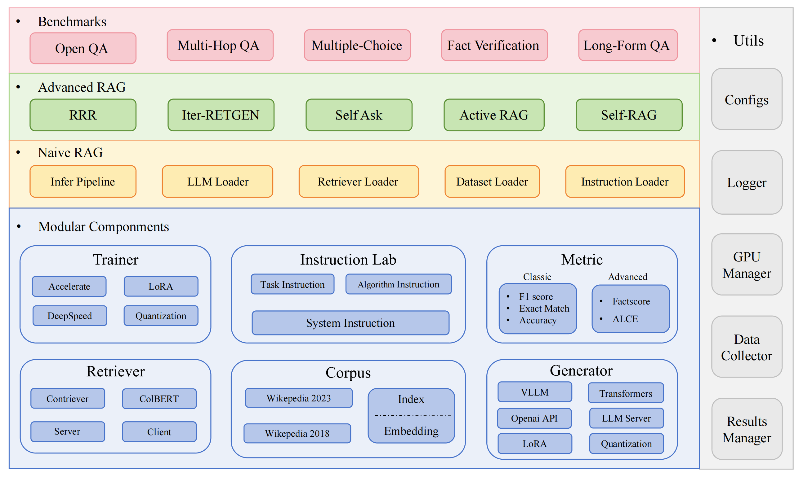

# 
RAGLAB: A Modular and Research-Oriented Unified Framework for Retrieval-Augmented Generation

- RAGLAB is a modular, research-oriented open-source framework for Retrieval-Augmented Generation (RAG) algorithms. It offers reproductions of 6 existing RAG algorithms and a comprehensive evaluation system with 10 benchmark datasets, enabling fair comparisons between RAG algorithms and easy expansion for efficient development of new algorithms, datasets, and evaluation metrics.

# News
- 2024.10.6: Our paper has been accepted by EMNLP 2024 System Demonstration.🎉 You can find our paper in [RAGLAB](https://arxiv.org/abs/2408.11381).
- 2024.9.9: RAGLAB has open-sourced all log files and evaluation files in [evaluation results](https://huggingface.co/datasets/RAGLAB/raglab-eval_results)📌
- 2024.8.20: RAGLAB has open-sourced 4 models🤗:
  [llama3-8B-baseline](https://huggingface.co/RAGLAB/Llama3-8B-baseline)
  [selfrag-llama3-8b](https://huggingface.co/RAGLAB/selfrag_llama3-8B)
  [llama3-70B-adaptor](https://huggingface.co/RAGLAB/Llama3-70B-baseline-adapter)
  [selfrag-llama3-70B-adaptor](https://huggingface.co/RAGLAB/selfrag_llama3_70B-adapter)
- 2024.8.6: RAGLAB is released🌈.

# 🌟Features
- **Comprehensive RAG Ecosystem:** Supports the entire RAG pipeline from data collection and training to auto-evaluation.
- **Advanced Algorithm Implementations:** Reproduces 6 state-of-the-art RAG algorithms, with an easy-to-extend framework for developing new algorithms.
- **Interact Mode & Evaluation Mode:** Interact Mode is specifically designed for quickly understanding algorithms. Evaluation Mode is specifically designed for reproducing paper results and scientific research.
- **Fair Comparison Platform:** Provides benchmark results for 6 algorithms across 5 task types and 10 datasets.
- **Efficient Retriever Client:** Offers local API for parallel access and caching, with average latency under 1 second.
- **Versatile Generator Support:** Compatible with 70B+ models, VLLM, and quantization techniques.
- **Flexible Instruction Lab:** Customizable instruction templates for various RAG scenarios.

# 📎Related works
- Interesting RAG applications
  - [Autosurvey](https://github.com/AutoSurveys/AutoSurvey)

# 🔨Install environment
- dev environment：pytorch:2.0.1-py3.10-cuda11.8.0-devel-ubuntu22.04
- [install miniconda](https://docs.anaconda.com/free/miniconda/index.html)

- git clone RAGLAB
  ~~~bash
  https://github.com/fate-ubw/RAGLAB.git
  ~~~

- create environment from yml file 
  ~~~bash
  cd RAGLAB
  conda env create -f environment.yml
  ~~~
- install flash-attn, en_core_web_sm, punkt manually
  ~~~bash
  pip install flash-attn==2.2
  python -m spacy download en_core_web_sm
  python -m nltk.downloader punkt
  ~~~

# 🤗 Models

raglab need several models please download them

  ~~~bash
  cd RAGLAB
  mkdir model
  cd model
  mkdir output_models
  # retriever model
  mkdir colbertv2.0
  huggingface-cli download colbert-ir/colbertv2.0 --local-dir colbertv2.0/ --local-dir-use-symlinks False
  mkdir contriever-msmarco
  huggingface-cli download facebook/contriever-msmarco --local-dir contriever-msmarco/ --local-dir-use-symlinks False
  
  # finetuned generator
  # 8B model
  mkdir Llama3-8B-baseline
  huggingface-cli download RAGLAB/Llama3-8B-baseline --local-dir Llama3-8B-baseline/ --local-dir-use-symlinks False
  mkdir selfrag_llama3_8b-epoch_0_1
  huggingface-cli download RAGLAB/selfrag_llama3-8B --local-dir selfrag_llama3_8b-epoch_0_1/ --local-dir-use-symlinks False
  # 70B model
  mkdir Llama3-70B-baseline-adapter
  huggingface-cli download RAGLAB/Llama3-70B-baseline-adapter --local-dir Llama3-70B-baseline-adapter/ --local-dir-use-symlinks False
  mkdir selfrag_llama3_70B-adapter
  huggingface-cli download RAGLAB/selfrag_llama3-70B-adapter --local-dir selfrag_llama3_70B-adapter/ --local-dir-use-symlinks False
  mkdir Meta-Llama-3-70B
  huggingface-cli download meta-llama/Meta-Llama-3-70B --local-dir Meta-Llama-3-70B/ --local-dir-use-symlinks False

  # base model for finetune and LoRA
  mkdir Meta-Llama-3-8B
  huggingface-cli download meta-llama/Meta-Llama-3-8B --local-dir Meta-Llama-3-8B/ --local-dir-use-symlinks False

  # ALCE Metric Models
  mkdir gpt2-large
  huggingface-cli download openai-community/gpt2-large --local-dir gpt2-large/ --local-dir-use-symlinks False
  mkdir roberta-large-squad
  huggingface-cli download gaotianyu1350/roberta-large-squad --local-dir roberta-large-squad/ --local-dir-use-symlinks False
  mkdir t5_xxl_true_nli_mixture
  huggingface-cli download google/t5_xxl_true_nli_mixture --local-dir t5_xxl_true_nli_mixture/ --local-dir-use-symlinks False

  # factscore model we use gpt3.5 for evaluation, so no need to download local models

  # models from official selfrag repo
  mkdir selfrag_llama2_7b
  huggingface-cli download selfrag/selfrag_llama2_7b --local-dir selfrag_llama2_7b/ --local-dir-use-symlinks False
  # you can download other model as generator from huggingface
  ~~~

# 🤗 Whole Data
- If you only need to understand how different algorithms work, the interact mode developed by RAGLAB can meet your needs. 
- If you want to reproduce the results from the papers, you need to download all the required data from Hugging Face, including training data, knowledge data, and evaluation data. We have packaged all the data for you, so you just need to download it and it's ready to use.
  ~~~bash
  cd RAGLAB
  huggingface-cli download RAGLAB/data --local-dir data --repo-type dataset
  ~~~

# Run Raglab in Interact Mode
- Interact Mode is specifically designed for quickly understanding algorithms. In interact mode, you can run various algorithms very quickly, understand the reasoning process of different algorithms, without needing to download any additional data.

## Setup colbert server
- All algorithms integrated in raglab include two modes: `interact` and `evaluation`. The test stage demonstrates in `interact` mode, just for demostration and eduction 🤗.
> [!NOTE]
> - Due to colbert's requirement for absolute paths, you need to modify the index_dbPath and text_dbPath in the config file to use absolute paths.
- Modify the `index_dbPath` and `text_dbPath` in config file:[colbert_server-10samples.yaml](./config/colbert_server/colbert_server-10samples.yaml)
  ~~~bash
  index_dbPath: /your_root_path/RAGLAB/data/retrieval/colbertv2.0_embedding/wiki2023-10samples
  text_dbPath: /your_root_path/RAGLAB/data/retrieval/colbertv2.0_passages/wiki2023-10samples/enwiki-20230401-10samples.tsv
  ~~~
- run colbert server 
  ~~~bash
  cd RAGLAB
  sh run/colbert_server/colbert_server-10samples.sh
  ~~~
> [!NOTE]
> - At this point, colbert embedding will prompt that due to path errors, colbert embedding needs to be reprocessed. Please enter `yes` and then raglab will automatically help you process the embedding and start the colbert server.
- Now please open another terminal and try to request the colbert server
  ~~~bash
  cd RAGLAB
  sh run/colbert_server/ask_api.sh
  ~~~
  - If a result is returned, it means the colbert server has started successfully! 🌈
- run [selfrag](https://arxiv.org/abs/2310.11511) (short form & adaptive retrieval) interact mode test 10-samples embedding
  ~~~bash
  cd RAGLAB
  sh run/rag_inference/3-selfrag_reproduction-interact-short_form-adaptive_retrieval.sh
  ~~~
- Congratulations！！！Now you have already know how to run raglab 🌈
- In raglab, each algorithm has 10 queries built-in in interact mode which are sampled from different benchmarks

# Reproduce paper results 
> [!NOTE]
> - remember download  [wiki2018 konwledge database](#🤗whole-data) and [model](#🤗models) before runing paper results
## Retrieval server & api
- Due to colbert's requirement for absolute paths, you need to modify the `index_dbPath` and `text_dbPath` in config file and process the wiki2018 embedding database
  - Modify the paths in the config file
  ~~~bash
  cd RAGLAB/config/colbert_server
  vim colbert_server.yaml
  index_dbPath: {your_root_path}/RAGLAB/data/retrieval/colbertv2.0_embedding/wiki2018
  text_dbPath: {your_root_path}/RAGLAB/data/retrieval/colbertv2.0_passages/wiki2018/wiki2018.tsv
  ~~~
  - Modify the absolute paths bound in the wiki2018 embedding source file
  ~~~bash
  vim /data/retrieval/colbertv2.0_embedding/wiki2018/indexes/wiki2018/metadata.json
  # change root path, other parameters do not need to be modified
  "collection": "/{your_root_path}/RAGLAB/data/retrieval/colbertv2.0_passages/wiki2018/wiki2018.tsv",
  "experiment": "/{your_root_path}/RAGLAB/data/retrieval/colbertv2.0_embedding/wiki2018",
  ~~~
- Attention: colbert_server need atleast 60GB ram 
  ~~~bash
  cd RAGLAB
  sh run/colbert_server/colbert_server.sh
  ~~~
- open another terminal test your ColBERT server
  ~~~bash
  cd RAGLAB
  sh run/colbert_server/ask_api.sh
  ~~~
- ColBERT server started successfully!!! 🌈
## Automatic GPU Scheduler
- inference experiments require running hundreds of scripts in parallel, the [automatic gpu scheduler](https://github.com/ExpectationMax/simple_gpu_scheduler) needs to be used to automatically allocate GPUs for different bash scripts in Parallel.
- install `simple_gpu_scheduler`
  ~~~bash
  pip install simple_gpu_scheduler
  ~~~
- run hundreds of experiments in one line 😎
  ~~~bash
  cd RAGLAB
  simple_gpu_scheduler --gpus 0,1,2,3,4,5,6,7 < auto_gpu_scheduling_scripts/auto_run-llama3_8b-baseline-scripts.txt
  # Other scripts can be run using the same method
  ~~~
- how to write your_script.txt?
  - here is an example
  ~~~bash
  # auto_inference_selfreg-7b.txt
  sh run/rag_inference/selfrag_reproduction/selfrag_reproduction-evaluation-short_form-PubHealth-adaptive_retrieval-pregiven_passages.sh
  sh run/rag_inference/selfrag_reproduction/selfrag_reproduction-evaluation-short_form-PubHealth-always_retrieval-pregiven_passages.sh
  ~~~
## Evaluation for ALCE & Factscore

- RAGLAB includes 3 classic evaluation methods: accuracy, F1, and EM (Exact Match). These 3 methods are simple to calculate, so they can be computed dynamically during the inference process. However, ALCE and Factscore, two advanced metrics, require the completion of the inference process before evaluation.
- **ALCE**: RAGLAB has integrated the ALCE repository into RAGLAB. You only need to set the path for the inference results in the config file.
  ~~~bash
  cd RAGLAB
  cd run/ALCE/

  # Change the path in each sh file for the inference generated files
  # For example:
  # python  ./ALCE/eval.py --f './data/eval_results/ASQA/{your_input_file_path}.jsonl' \
  #     --mauve \
  #     --qa

  simple_gpu_scheduler --gpus 0,1,2,3,4,5,6,7 < auto_gpu_scheduling_scripts/auto_eval_ALCE.txt

  ~~~
- The evaluation results will be in the same directory as the input file, with the file name suffix `.score`

- **Factscore**: The Factscore environment requires installation of `torch 1.13.1`, which conflicts with the flash-attn version needed in RAGLAB's training and inference modules. Therefore, RAGLAB currently cannot integrate the Factscore environment, so users need to install the [Factscore](https://github.com/shmsw25/FActScore) environment separately for evaluation.
- After installing the Factscore environment, please modify the path of the inference results in the bash file
  ~~~bash
  cd RAGLAB/run/Factscore/

  # change the path in each sh file for the inference generated files
  # For example:
  # python  ./FActScore/factscore/factscorer.py  \
  #  --input_path './data/eval_results/Factscore/{your_input_file_path}.jsonl' \
  #   --model_name "retrieval+ChatGPT"\
  #   --openai_key ./api_keys.txt \
  #  --data_dir ./data/retrieval/colbertv2.0_passages/wiki2023 \
  #  --verbose

  simple_gpu_scheduler --gpus 0,1,2,3,4,5,6,7 < auto_gpu_scheduling_scripts/auto_eval_Factscore.txt
  ~~~
- The evaluation results will be in the same directory as the input file, with the file name suffix `_factscore_output.json`
> [!NOTE]
> - During the Factscore evaluation process, we used GPT-3.5 as the evaluation model, so there's no need to download a local model. If you need to use a local model to evaluate Factscore, please refer to [Factscore](https://github.com/shmsw25/FActScore)

# Process knowledge database from source
- If you wish to process the knowledge database yourself, please refer to the following steps. RAGLAB has already uploaded the processed knowledge database to [Hugging Face](https://huggingface.co/datasets/RAGLAB/data)
- document: [process_wiki.md](./docs/process_wiki.md)

# 🤖 Train models
- This section covers the process of training models in RAGLAB. You can either download all pre-trained models from HuggingFace🤗, or use the tutorial below to train from scratch📝.
- [All data](#all-data-for-reproduce-paper-results) provides all data necessary for finetuning.
- document: [train_docs.md](./docs/train_docs.md)

## Citation
If you find this repository useful, please cite our work.
~~~
@inproceedings{zhang-etal-2024-raglab,
    title = "{RAGLAB}: A Modular and Research-Oriented Unified Framework for Retrieval-Augmented Generation",
    author = "Zhang, Xuanwang and
      Song, Yunze and
      Wang, Yidong and
      Tang, Shuyun and
      others",
    booktitle = "Proceedings of the 2024 Conference on Empirical Methods in Natural Language Processing: System Demonstrations",
    month = dec,
    year = "2024",
    publisher = "Association for Computational Linguistics",
}
~~~

## :bookmark: License

RAGLAB is licensed under the [MIT License](./LICENSE).
